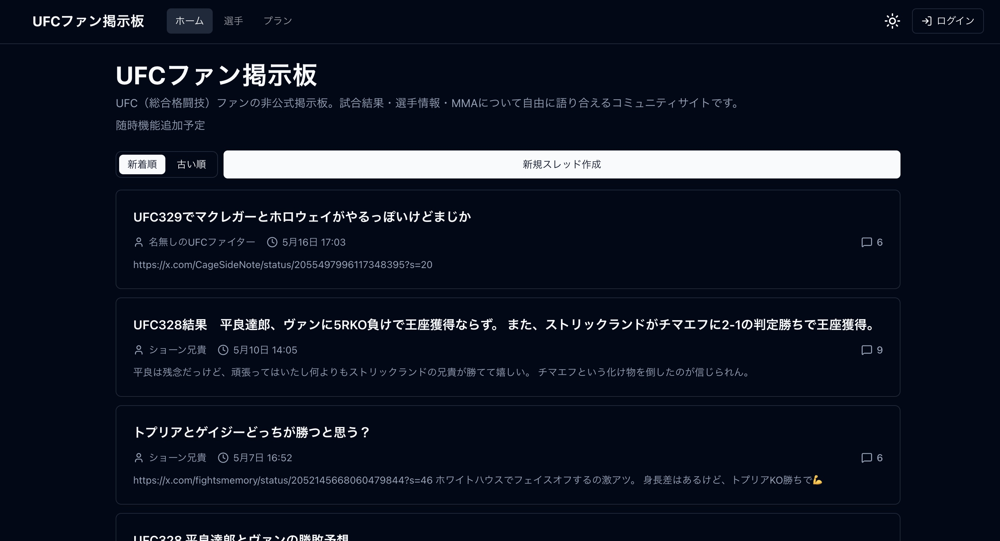
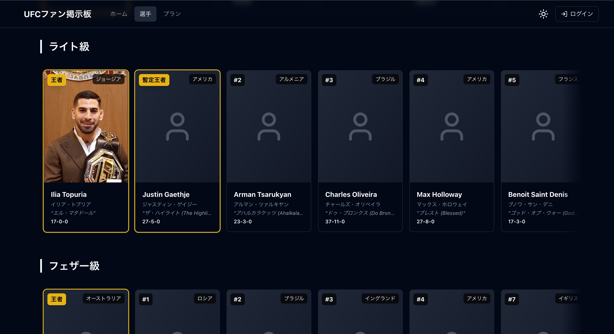

# UFCファン向け掲示板・コミュニティアプリ

UFC・格闘技ファンが、試合や選手について投稿・議論できるコミュニティアプリです。

**アプリURL**: https://ufc-fan-community.com  
**GitHub**: https://github.com/kogechan/portfolio
**開発期間**: 1〜3ヶ月

## 画面イメージ

| 掲示板トップ                                        | 選手一覧                                           |
| --------------------------------------------------- | -------------------------------------------------- |
|  |  |

---

## 概要

総合格闘技団体UFCについて、試合や選手について投稿・議論できるコミュニティWebアプリです。掲示板、選手一覧・詳細、選手別コメント、Google認証、Stripe課金、管理者機能、本番デプロイ構成まで実装しました。

## なぜ作ったか

日本でも人気が高まりつつあるUFCについて、日本語で継続的に語れる場所を作りたいと考え開発しました。一般的な掲示板ではなく、選手単位で情報やコメントが蓄積される構成にすることで、試合前後の議論や選手への関心を整理しやすくすることを目指しました。
また、個人開発として投稿機能だけで終わらせず、認証、DB設計、課金、管理画面、デプロイ運用まで含めたWebアプリ全体の開発経験を積むことも目的にしました。

## 主な機能

- **掲示板**: スレッド作成、コメント投稿、画像投稿、SNS URL埋め込み、新着/古い順ソート、無限スクロール
- **選手**: 階級別の選手一覧、選手詳細、選手別コメント
- **認証**: Googleログイン、表示名変更
- **課金**: Stripe Checkout、Customer Portal、Webhookによる課金状態同期
- **管理画面**: 管理者による選手データの登録・編集・削除
- **運用**: Docker、VPS、Nginx、SSL、GitHub Actions CI

## 技術スタック

| 領域                 | 使用技術                                |
| -------------------- | --------------------------------------- |
| フロントエンド       | Next.js App Router / React / TypeScript |
| UI                   | shadcn/ui / lucide-react / Tailwind CSS |
| バックエンド         | Next.js API Routes                      |
| 状態管理・データ取得 | TanStack Query                          |
| 認証                 | NextAuth.js / Google OAuth              |
| DB                   | PostgreSQL / Prisma                     |
| 決済                 | Stripe                                  |
| インフラ             | Docker / XServer VPS / Nginx            |
| CI                   | GitHub Actions                          |
| テスト               | Vitest                                  |

## アプリケーション構成

```text
src/
├── app/              # RSCのコンポーネント・API Route
├── features/         # 機能単位のコンポーネント・フック
│   ├── Thread/       # 掲示板スレッド関連
│   ├── ThreadComment/ # スレッドコメント関連
│   ├── Fighter/      # 選手一覧・詳細
│   ├── FighterComment/ # 選手別コメント
│   ├── Settings/     # ユーザー設定・プラン管理
│   ├── Pricing/      # 料金ページ
│   ├── Admin/        # 管理画面
│   ├── Shell/        # Header / Footer / Sidebar / Layout
│   └── Legal/        # プライバシーポリシー・特商法
├── server/           # サーバー専用処理
│   ├── services/     # Prismaクエリを集約したサービス層
│   ├── validation/   # Zodによる入力検証スキーマ
│   └── stripe/       # Stripeレスポンスのマッパー関数
├── hooks/            # 共通カスタムフック
├── lib/              # 認証・Prisma・Stripe・APIヘルパー
├── constants/        # サイト定数
├── components/ui/    # 汎用UIコンポーネント
├── types/            # TypeScript型定義
└── utils/            # ナビゲーション・表示ラベルなどのユーティリティ
```

## 実装で意識したこと

- **責務分離**: API RouteからDBアクセスをサービス層（`server/services/`）に切り出し、ルートはリクエスト処理に専念する構成
- **セキュリティ**: 投稿者名や課金権限はクライアント入力に依存せず、API側でセッション・DBから検証
- **入力検証の統一**: Zodスキーマを`server/validation/`に集約し、全APIエンドポイントで一貫した検証を適用
- **管理権限**: 管理画面・管理APIはMiddlewareで保護し、権限なしは404で返す（存在を見せにくい設計）
- **課金の堅牢性**: Stripe Webhookは冪等性を考慮し、イベントID・処理状態・影響行数・エラーをDBに記録
- **運用前提**: Docker Compose、Nginx、SSL、バックアップ、GitHub Actions CIを用意
- **パフォーマンス**: カーソルベースのページネーションと無限スクロールでスレッド一覧を実装

## デプロイ関連

本番運用を想定した設定ファイルとスクリプトを用意しています。

- `docker-compose.prod.yml` - 本番用Docker Compose設定
- `Dockerfile` - Next.jsアプリのコンテナ定義
- `setup-vps.sh` - VPS初期設定
- `quick-deploy.sh` - 初回デプロイ
- `deploy.sh` - 更新デプロイ
- `setup-nginx.sh` - Nginx設定
- `setup-ssl.sh` - SSL証明書設定
- `backup.sh` - DBバックアップ

## 今後の改善予定

- 新機能の追加
- 既存機能の改修
- UI改善
- 有料コンテンツの拡充
- より保守性と運用性を考慮したリファクタリング
- テストカバレッジの考慮
- サイトのパフォーマンス改善
